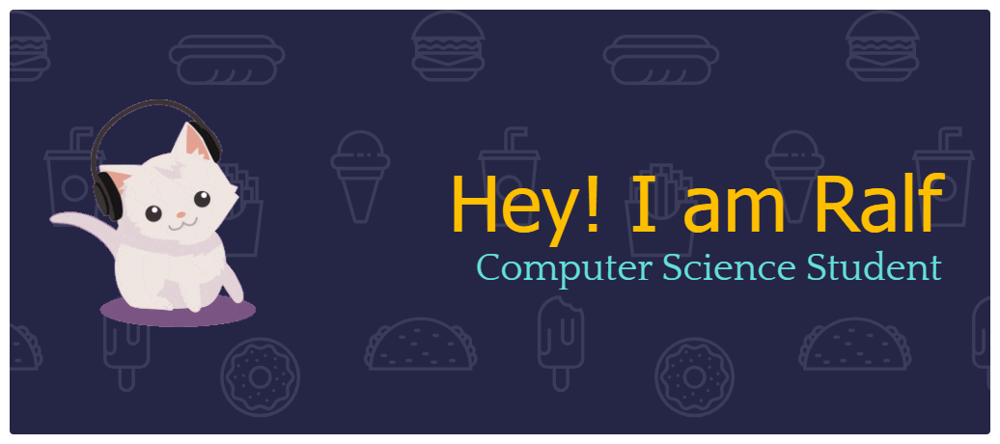

I’m **Ralf G. Neis**, a **Computer Science student** passionate about **gaming**, **game development**, **web design**, and **UI design**.  
This portfolio showcases my projects, designs, and the skills I’ve developed as I continue my journey in technology and creativity.

---

## 🚀 About Me

Hi there! 👋  
I’m a **Computer Science student** who enjoys bringing ideas to life through **code** and **design**. Whether it’s building games or crafting user-friendly web interfaces, I’m always exploring new ways to merge creativity and functionality.

Currently, I’m focused on:
- 🎮 Game Development and Design  
- 💡 Front-End Web Development  
- 🧠 Exploring AI Projects  
- 🎨 User Interface & Experience Design

My goal is to become a **game developer** capable of building engaging experiences that people enjoy playing.

---

## 🧠 Skills

**Languages:**  
`C` • `C++` • `Java` • `Python` • `JavaScript` • `HTML` • `CSS`

**Tools & Frameworks:**  
`Git` • `VS Code` • `Figma` • `Canva` • `Unity`  

**Areas of Interest:**  
🎮 Game Development • 🌐 Web Design • 🎨 UI Design • 🤖 Artificial Intelligence

---

## 🧩 Featured Projects

| Project | Description | Technologies |
|----------|--------------|---------------|
| 🎮 **ALAMAT NI NEO** | A 2D mini adventure game. | Java |
| 🏧 **ATM NG MGA POGI** | An ATM machine simulation that demonstrates basic banking operations and file handling in C++. | C++ |

---

## 🧱 Currently Working On

| Project | Description | Focus |
|----------|--------------|--------|
| 🍳 **KusinaSeekr** | Designing a web platform for discovering and sharing local Filipino recipes. | Web Design / Front-End Development |
| 🚗 **Vehicle Counter AI** | Developing an AI system that automates vehicle counting and categorization through live camera feeds. | Artificial Intelligence / Data Analytics |
